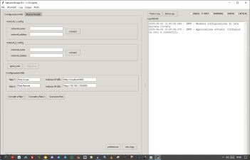

# Network Bridge

Un'applicazione avanzata per il monitoraggio e il bridging di reti locali, con supporto multilingua e un'interfaccia utente intuitiva.



## 🌟 Caratteristiche principali

- **Gestione di più reti** contemporaneamente
- **Scansione avanzata** delle risorse di rete
- **Interfaccia utente moderna** con tema scuro/chiaro
- **Logging dettagliato** con filtri personalizzabili
- **Supporto multilingua** (Inglese e Italiano)
- **Esportazione dati** in vari formati
- **Monitoraggio in tempo reale** dello stato della rete

## 📋 Requisiti di sistema

- Python 3.8 o superiore
- Sistema operativo: Windows 10/11, macOS, o Linux
- Connessione di rete attiva
- Permessi di amministratore (per alcune funzionalità di scansione)

## 🚀 Installazione

1. Clona il repository:
   ```bash
   git clone https://github.com/tuoutente/network-bridge.git
   cd network-bridge
   ```

2. Crea e attiva un ambiente virtuale (consigliato):
   ```bash
   python -m venv venv
   source venv/bin/activate  # Su Windows: venv\Scripts\activate
   ```

3. Installa le dipendenze:
   ```bash
   pip install -r requirements.txt
   ```

## 🏁 Avvio rapido

1. Avvia l'applicazione:
   ```bash
   python main.py
   ```

2. Configura le reti:
   - Inserisci nomi descrittivi per le reti
   - Specifica gli indirizzi IP o i nomi host
   - Clicca su "Connetti" per ogni rete

3. Utilizza le funzionalità avanzate:
   - Scansione rete
   - Monitoraggio in tempo reale
   - Esportazione dati
   - Filtri personalizzati

## 🛠️ Struttura del progetto

```
network-bridge/
├── app/                 # Codice sorgente principale
│   ├── bridge.py        # Logica principale dell'applicazione
│   └── ...
├── struttura/           # Moduli di supporto
│   ├── lang.py          # Gestione lingue
│   └── ...
├── assets/              # Risorse (immagini, icone, ecc.)
├── tests/               # Test automatici
├── requirements.txt     # Dipendenze Python
├── README.md            # Questo file
└── main.py              # Punto di ingresso
```

## 🌍 Supporto lingue

Attualmente supportato:
- 🇬🇧 Inglese (predefinito)
- 🇮🇹 Italiano

## 🤝 Contributi

I contributi sono ben accetti! Per favore leggi le nostre [linee guida per i contributi](CONTRIBUTING.md) prima di inviare una pull request.

## 📄 Licenza

Questo progetto è concesso in licenza con la licenza GPL3 - vedi il file [LICENSE](LICENSE) per i dettagli.

## 📧 Contatti

Per domande o supporto, contattaci a: Nsfr750@yandex.com
- Alcune funzionalità potrebbero richiedere privilegi di amministratore
- L'applicazione è pensata per uso interno e non include misure di sicurezza avanzate per ambienti di produzione
